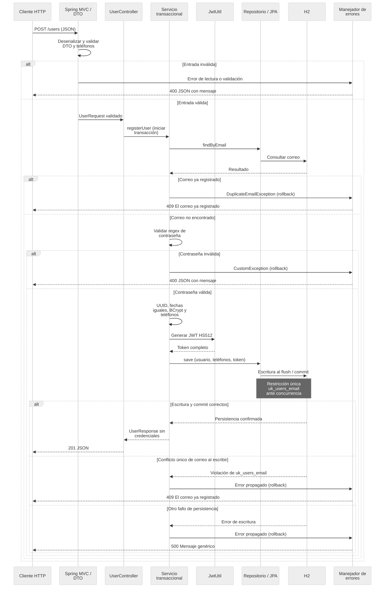

# Arquitectura de registro de usuarios

[Volver al README](../README.md)

## Capas y responsabilidades

- **Spring MVC y DTO de entrada:** deserializan JSON y validan textos obligatorios, correo y teléfonos en cascada antes de invocar el servicio.
- **UserController:** expone el registro público y devuelve el DTO con estado 201; no serializa entidades.
- **UserServiceImpl:** delimita la transacción, consulta el correo, aplica la política configurable de contraseña, calcula BCrypt y mapea usuario y teléfonos a la respuesta.
- **JwtUtil:** valida la configuración externa al iniciar y emite el token HS512 con UUID, correo, emisión y vencimiento.
- **UserRepository y JPA:** persisten las entidades y su relación; la base aplica la restricción única de correo.
- **GlobalExceptionHandler:** traduce las excepciones a estados HTTP y un único campo JSON `mensaje`, sin detalles internos.

Las capas mantienen responsabilidades distintas sin añadir una infraestructura de autenticación. Los DTO evitan exponer credenciales o relaciones JPA; la restricción de base protege frente a registros concurrentes que superen la consulta previa.

## Flujo del registro y transacción

El diagrama expresa el flujo lógico: `save` no garantiza que SQL se ejecute inmediatamente. El interceptor transaccional completa el flush y el commit antes de devolver el resultado al controlador. Un fallo en la escritura revierte usuario y teléfonos; el manejador identifica específicamente la restricción de correo, sin convertir cualquier error de integridad en duplicado.

## Persistencia y decisiones

[schema.sql](../user-management-api/src/main/resources/schema.sql) crea `users` y `phones` sobre H2 vacía; JPA valida el esquema. La clave foránea de cada teléfono es obligatoria y la persistencia en cascada mantiene el conjunto en una sola transacción. El token usa `CLOB` y las fechas `TIMESTAMP(9)`.

El registro inicial asigna un UUID y un único `LocalDateTime` a `created`, `modified` y `last_login`. Estos valores no contienen zona horaria. `last_login` conserva el nombre del contrato; no acredita la existencia de login.

H2 en memoria simplifica la ejecución local y las pruebas, pero no conserva datos tras detener el proceso. BCrypt evita almacenar la contraseña en texto claro. HS512 usa una clave externa con tamaño validado; las pruebas cargan una clave propia que no se distribuye en el JAR.

## Límites del diseño

La API registra usuarios y emite un token, sin autenticar peticiones ni implementar CRUD completo. La comparación de correo conserva el valor recibido, sin normalización. Las herramientas Swagger y H2 son auxiliares; la consola y SQL se habilitan únicamente con `dev` explícito, según el [README](../README.md#persistencia-y-modos-de-ejecución).

Las pruebas incluyen una escritura con conflicto de unicidad y un fallo con rollback observado después de terminar la transacción. Esto aporta evidencia del comportamiento local sobre H2, sin afirmar operación productiva o persistencia permanente.
